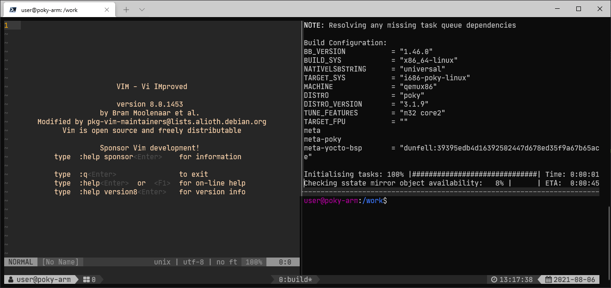

# poky-build

Containerised build system for Embedded Linux development, using Docker containers

## Machine Requirements

- Linux Kernel 5.4
- Docker Engine 20
- 12 GiB of RAM and 4+ logical CPU cores
- 128 GiB of filesystem storage space

Filesystem storage can be slow HDD, if enough RAM is available for caching (rule-of-thumb 4 GiB of RAM per core).

## Installation

- Install Docker as described on the official documentation. *Do not use the default package provided by your distro*.
- Install `nfs-kernel-server` and `tftpd-hpa` for netboot support
- Use the provided configuration files in `hostcnf`
    - `exports` defines NFS exports, cp to `/etc/exports`
    - `tftpd-hpa` sets up the tftp server, cp to `/etc/default/tftpd-hpa`
- Run `docker-compose build`

## Usage

Start a new container using the `launch` script: `./launch <type>`. Multiple machine types for easier devenv setup are provided:

- `arm`: 32-bit ARM MPU support (sets up CROSS\_COMPILE)
- `qemuarm`: 32-bit ARM specifically for QEMU
- `x86`: 32-bit x86 support
- `qemux86`: 32-bit x86 specifically for QEMU

Additional configurations can be added using existing entries in `docker-compose.yml` as a template.

**Recommended:** Use tmux and vim on your host, instead of inside the container.

## Notes

### General usage

- tmux-power8 uses [*NerdFonts*](https://www.nerdfonts.com/) extended fonts. Install a compatible font for your terminal, for symbols to show up correctly (Examples use "JetBrains Mono Nerd Font").
- Use tmux and vim on your host system instead and use multiple container instances

### Running QEMU

- Use the `slirp` option in case you get an error message regarding an inaccessible `tun` device
